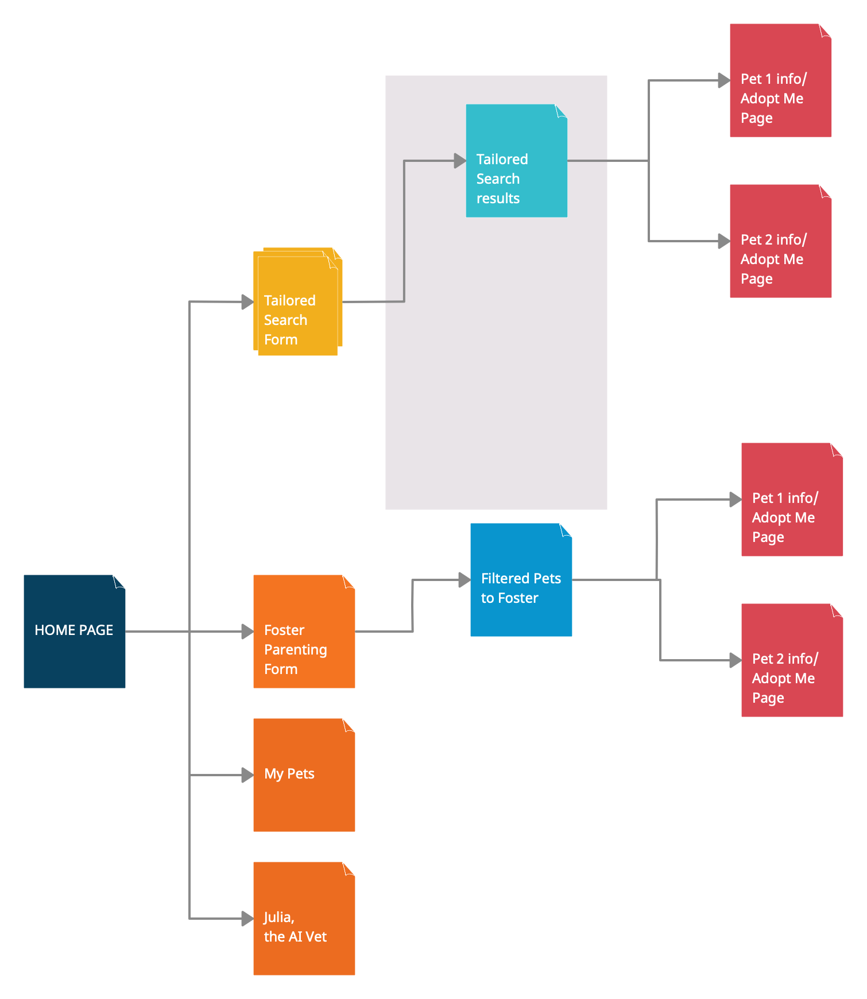

# AdoptionBuddy 

## Overview


AdoptionBuddy is a pet adoption app! It allows you to search for a pet by different characteristics such as breed, gender, location, and age. If you find a pet you like you can adopt them, and this pet will be added to a page titled My Pets. You can also choose to see the foster pets, and foster an animal instead for a particular time frame. These pets will also be stored in My Pets. AdoptionBuddy will contain a Virtual AI Medical Care, an AI vet named Julia who can advise you on any issues you have regarding your pets.


## Data Model


The application will store Users, Pets, Qualities and Images of Pets

* users can have multiple pets (via references)
* each pet can have multiple qualities (by embedding)
* each pet will have one image (via reference)


An Example User:

```javascript
{
  username: "writer360",
  password: "books4lyfe124"
}
```

An Example Pet with Embedded Qualities:

```javascript
{
  name: "Teddy",
  animal: "dog", 
  age: "3", 
  location: Seattle, 
  breed: "goldenpoo", 
  gender: "boy", 
  canFoster: true
  qualities: [{favorite_activity: "fetch"}, {object: "collar", color: "green"}],
  image: //a reference handled with Multer(research topic)
  owner: "writer360"
}
```


## [Link to Commented First Draft Schema](db.mjs) 

## Wireframes


I did not end up implementing the first row second and third panels, nor the third panel in the second row, nor the panel in the third row due to time constraints. I removed the foster portion of the app, and made the adoption feature a button on the main page rather than 3 seperate pages. 

## Site map


Here's a [complex example from wikipedia](https://upload.wikimedia.org/wikipedia/commons/2/20/Sitemap_google.jpg), but you can create one without the screenshots, drop shadows, etc. ... just names of pages and where they flow to.



The Foster Parenting thread has been removed from the scope of this project.

## User Stories


1. As a person living alone, I want a dog so that I have more company.
2. As a writer, I want to foster a parrot so that I have inspiration for my pirate adventure novel.
3. As a dad, I want a dog so that my kids to play outside more.
4. As a college student in NYC, I want to foster a cat so that mice are afraid of my apartment.
5. As an animal rights activist, I want to foster animals so that these animals have a happier quality of life.
6. As a runner, I want to foster a dog so that I feel safe running at night.
7. As a new couple living together, I want to adopt a rabbit together so that we get practice raising someone before having children.
8. As a content creator, I want to adopt a koala so that my content gets more fun/interesting & I have a new journey to document. 
9. As a pet owner, I want to get AI advice on handling my allergy to my hamster so that I don’t have to return him to adoption.
10. As a user, I want to filter results so that I can find a male poodle to adopt in my city.

## Use Cases

1. Find pets to adopt and adopt a pet
2. See pets available for adoption
3. Filter results to find pets that fit your preferences
4. Find pets to foster and foster them for a particular time frame
5. See which pets are under your care
6. Get AI vet advice when encountered confusion around petcare.


## Research Topics


* (5 points) Image Access/Upload with Multer
    *  Multer is a middleware for handling non UTF-8 data/multipart/form-data, which is useful for file/image uploads in Node.js applications.I am going to be using Multer to store and access the images of the pets from local data. I will research what properties Multer has that enables easily accessing images and connecting my pet images to their respective Pet data models. The possible solution for this is req.file, a property of this middleware.
* (5 point) Open AI
    * Open AI is artificial intelligence or chatGPT. I think this could make my application more interactive and useful. I want to create an AI vet named Julia and use a prompt to give the AI vet qualifications and a specific personality. I will research integration techniques for openAI and express/Node.js/React.

10 points total out of 8 required points


## [Link to Initial Main Project File](/AdoptionBuddy/app.mjs) 

## Annotations / References Used

Multer research: 
https://medium.com/@tericcabrel/upload-files-to-the-node-js-server-with-express-and-multer-3c41f41a6e 

OpenAI research topic:
https://platform.openai.com/docs/quickstart?context=python 
https://platform.openai.com/docs/api-reference/assistants-v1/modifyAssistant

